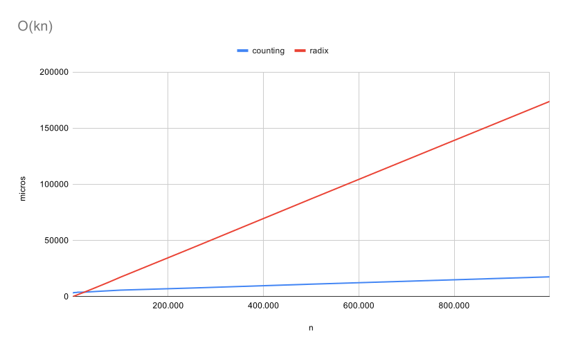
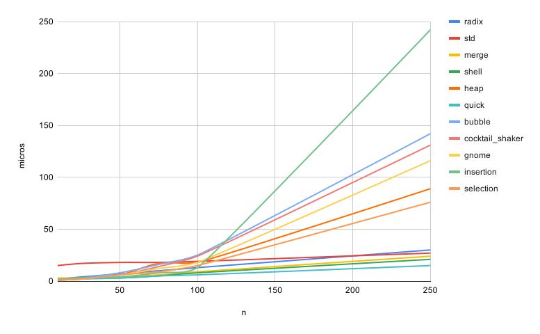
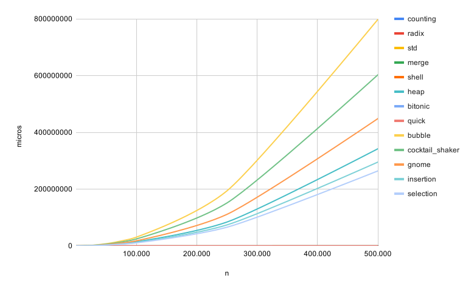
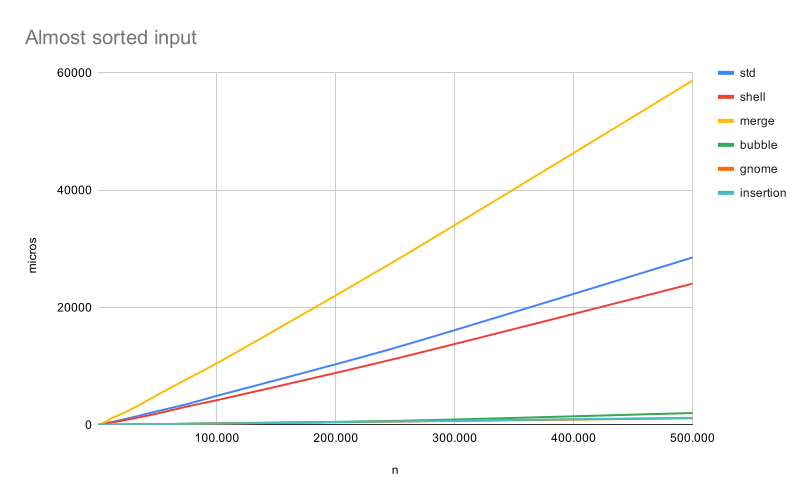

# Sorting Algorithms

Implementation of different sorting algorithms in C/C++ as well as time complexity analysis.

The following algorithms have been implemented:

- [bitonic sort](bitonic_sort/bitonic_sort.cpp)
- [bubble sort](bubble_sort/bubble_sort.cpp)
- [cocktail shaker sort (double insertion sort)](cocktail_shaker_sort/cocktail_shaker_sort.cpp)
- [counting sort](counting_sort/counting_sort.cpp)
- [std::sort](gcc_std_sort/gcc_std_sort.cpp)
- [gnome sort](gnome_sort/gnome_sort.cpp)
- [gravity sort](gravity_sort/gravity_sort.cpp)
- [heap sort](heap_sort/heap_sort.cpp)
- [insertion sort](insertion_sort/insertion_sort.cpp)
- [merge sort](merge_sort/merge_sort.cpp)
- [quick sort](quick_sort/quick_sort.cpp)
- [radix sort](radix_sort/radix_sort.cpp)
- [selection sort](selection_sort/selection_sort.cpp)
- [shell sort](shell_sort/shell_sort.cpp)

## Table of contents

<!--ts-->
   * [Sorting Algorithms](#sorting-algorithms)
   * [Table of contents](#table-of-contents)
   * [Getting Started](#getting-started)
      * [Running the example](#running-the-example)
      * [Generating test data](#generating-test-data)
      * [Testing the algorithms](#testing-the-algorithms)
   * [Time complexity analysis](#time-complexity-analysis)
      * [O(kn)](#okn)
      * [O(n lg(n))](#onlgn)
      * [O(n^2)](#on2)
   * [Contributing](#contributing)
   * [License](#license)
   * [Acknowledgments](#acknowledgments)
<!--te-->

## Getting Started

These instructions will get you a copy of the project up and running on your local machine for development and testing purposes.


### Running the example

1. Clone the repository.

    ```
    git clone https://github.com/cutlas62/sorting-algorithms.git
    ```

2. Compile the code (you may have to change directory).

    ```
    make
    ```

3. Run the example.

    ```
    ./main -a bubble
    ```

    This will sort the `100random.txt` file from low to high using bubble sort. If everything goes right, you should see this output.

    ```
    Sorting the array with bubble sort...

    The array is correctly sorted!
    ```


### Generating test data

1. After cloning the respository, compile the test_data_generator file.

    ```
    make generator
    ```

2. Create test data with the following parameters (`./test_data_generator -h` to display help):

    ```
    -n <nrows>   Number of rows to create
    -l <limit>   Maximum limit for the numbers
    -m <mode>    Randomness mode
            <mode>:
            random           Totally random order
            low_to_high      Numbers ordered from low to high
            high_to_low      Numbers ordered from high to low
    ```

    So, `./test_data_generator -n 250 -l 5000 -m random` will generate a file called `250random.txt` with 250 random numbers from 0 to 4999. All these test data files will be created in the folder `test_data`.


### Testing the algorithms

After cloning the repository and compiling the main code, run `./main` with the following parameters (`./main -h` to display help):

```
-f, --file               Input file with random data to sort. This file has to be in test_data
-v, --verbose            Display both the unsorted and sorted data
-s, --stats              Display algorithms statistics
-a, --alg <algorithm>    Select the sorting algorithm to test
```

All the possible values for `<algorithm>` are:

- `bitonic` for bitonic sort
- `bubble` for bubble sort
- `cocktail_shaker` for cocktail shaker sort, a.k.a. double insertion sort
- `counting` for counting sort
- `gcc_std` for std::sort
- `gnome` for gnome sort
- `gravity` for gravity sort
- `heap` for heap sort
- `insertion` for insertion sort
- `merge` for merge sort
- `quick` for quick sort
- `radix` for radix (LSB) sort
- `selection` for seletion sort
- `shell` for shell sort

So, 

- `./main -f 500random.txt -a gnome -s` will sort the data file `test_data/500random.txt` using gnome sort and will display statistics (time, array accesses and comparisons).
- `./main -a merge -v` will sort the data file `test_data/100random.txt` (default file unless otherwise specified) using merge sort and displaying verbose info (both unsorted and sorted arrays).


## Time complexity analysis

The whole time complexity study and all these graphs were run on an AMD Ryzen 9 4900HS single core.

### O(kn)

Counting and Radix sort top the list when it comes to low execution times, but this comes at a price

Counting sort needs the maximum element beforehand (whose calculation hasn't been taken towards the time complexity, [see this](counting_sort/counting_sort.cpp#L7)) and its space complexity is O(k+n) and I had to limit the input in order to avoid segmentation faults.

Radix sort also has a space complexity of O(k+n) so the input had to be capped as well ([see this](radix_sort/radix_sort.cpp#L11)).



### O(n lg(n))

Following the list are std:sort, merge and shell, among others, with a time complexity of O(n lg(n)).

std::sort is a special case since it uses three different sorting algorithms depending on the input data size and depth. For this study, std:sort was using quick sort, which is a special case again because it's time complexity is O(n^2) for the worst case, but its running times are much smaller because it's very easy to be optimized. Check out [this site](https://www.khanacademy.org/computing/computer-science/algorithms/quick-sort/a/analysis-of-quicksort) for more info.


### O(n^2)

At the end of the list we have bubble, insertion, cocktail shaker (double insertion), selection and gnome sorts. These are usually the easiest to implement but the least efficient as well.

For a small number of inputs, the performance difference between O(n lg(n)) and O(n^2) may not look too big as in the image below. For an input array of 250 elements, the difference between the best and the worst algorithms is only around 200 microseconds.



However, as the input size increases, so does the running time. For a 500.000 element input array, the running time goes from 62 milliseconds to 12 minutes...



Does this means we should ALWAYS use a sorting algorithm with a time complexity of O(n lg(n)) instead of O(n^2)? Well, for the majority of cases the answer is yes, but not always. The previous measurements were taken for a random input but in the best-case scenario, the roles are switched.



To sum up, what sorting algorithm should be used depends on many different aspects such as input size, input randomness, available RAM and number of CPU/GPU cores available. For example, bitonic is very popular in parallel structures but not so much in single CPU systems. If you are sorting totally random data, merge sort should be fine but if you are inserting a new entry into a sorted database, insertion sort might be the way to go...

And in embedded systems, never forget about the space complexity.


## Contributing
Pull requests are welcome. For major changes, please open an issue first to discuss what you would like to change.

Please make sure to update tests as appropriate.

Also note this project was made for learning and fun, I'm sure it's not the most efficient code out there.


## License

This project is licensed under the MIT License - see the [LICENSE](LICENSE) file for details.

## Acknowledgments

Hat tip to:

* [GeeksForGeeks](http://www.geeksforgeeks.org)
* [Interview Cake](http://www.interviewcake.com)
* [My gf](https://github.com/evaesteban) for continuous support
